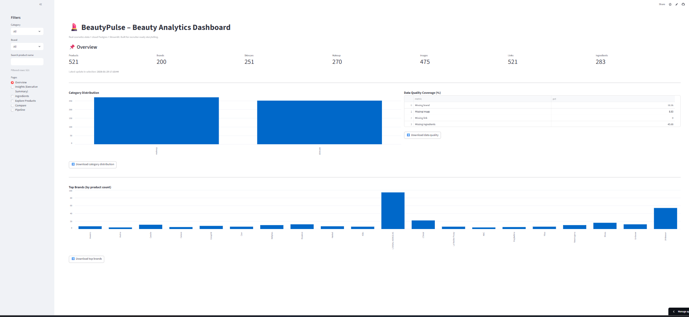
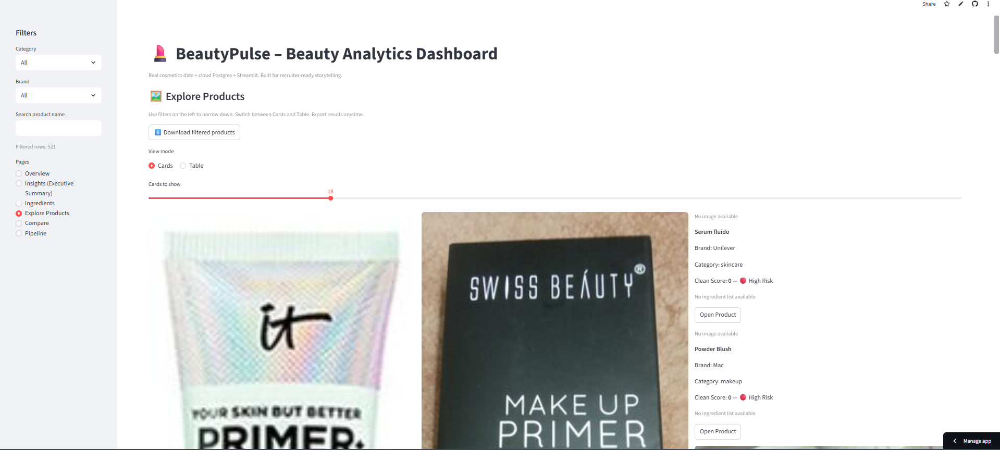
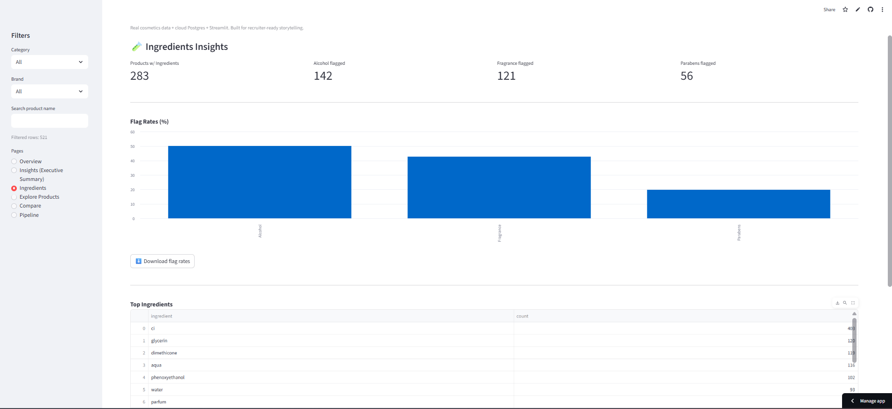

# BeautyPulse – Skincare & Makeup Analytics Dashboard 💄

A production-style **Data Engineering + Analytics** project that ingests real beauty product data, stores it in a cloud PostgreSQL database, and serves insights through a deployed Streamlit dashboard.

## 🔗 Live Demo
- **Streamlit App:** https://beautypulse-dashboard-wifjlsensbn9uzottpkpad.streamlit.app/

## 📸 Screenshots

### Overview


### Explore Products (Cards)


### Ingredients Analytics


---

## 🚀 What This Project Does
- Pulls **real skincare + makeup product data** from **Open Beauty Facts**
- Loads into **PostgreSQL (Neon)** using repeatable upserts (idempotent loads)
- Provides an interactive dashboard for:
  - KPIs + category distribution
  - Data quality coverage (missing brand/image/link/ingredients)
  - Ingredient analytics (top ingredients + flags: alcohol, fragrance, parabens)
  - Executive insights (auto-generated summary)
  - Product exploration with images + links
  - Compare products (ingredient overlap + clean score)
  - Pipeline monitoring (pipeline_runs table)

---

## 🧱 Architecture

**1) Ingest**
- Python script fetches product data from Open Beauty Facts API

**2) Transform**
- Cleans + standardizes fields (brand/category)
- Parses ingredients and computes risk flags + clean score

**3) Load**
- Stores data in Neon Postgres
- Tracks runs in `pipeline_runs`

**4) Serve**
- Streamlit dashboard reads from Postgres and provides interactive analytics

---

## 🛠 Tech Stack
- **Python**, **Pandas**, **Requests**
- **PostgreSQL (Neon)**
- **SQLAlchemy**
- **Streamlit (Community Cloud)**

---

## 📂 Repo Structure
```txt
beautypulse-dashboard/
  app/
    streamlit_app.py
  ingest/
    fetch_and_load.py
  assets/
    overview.png
    explore.png
    ingredients.png
  requirements.txt
  runtime.txt
  README.md
